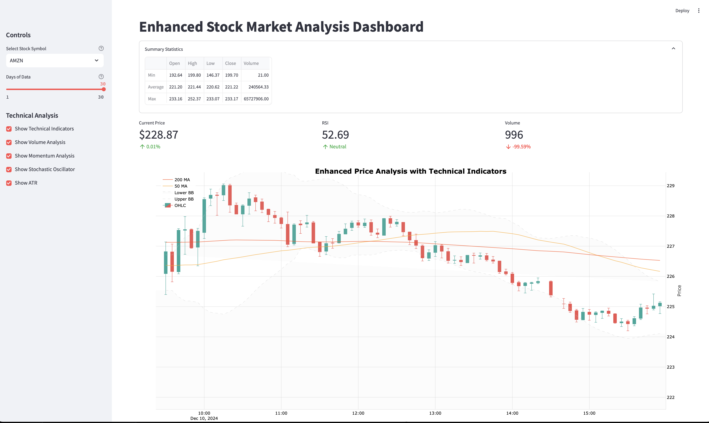
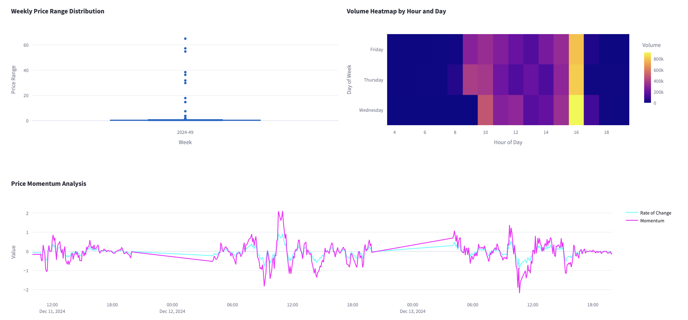

# StockPulse


A robust, production-ready stock market data pipeline built on Google Cloud Platform (GCP) that processes and analyzes high-frequency stock data in real-time. This project demonstrates advanced data engineering practices including parallel processing, data validation, and real-time analytics.



## 🎯 Key Features

- **Real-time Processing**: Fetches and processes stock data at 5-minute intervals
- **Scalable Architecture**: Built on GCP services for high availability and scalability
- **Intelligent Rate Limiting**: Smart API key rotation system
- **Robust Error Handling**: Comprehensive retry mechanisms and validation
- **Advanced Analytics**: Real-time technical indicators and market analysis
- **Interactive Dashboard**: Rich visualization powered by Streamlit
- **Data Integrity**: Multi-layer deduplication and validation processes
- **High Performance**: Processes ~4,000 data points per stock over 30 days

### Data Flow

1. **Data Collection**

   - Alpha Vantage API integration
   - Rate limit management
   - Initial data validation

2. **Message Queue**

   - Google Pub/Sub implementation
   - Asynchronous message processing
   - Message persistence and retry logic

3. **Data Processing**

   ```
   Raw Data -> Validation -> Transformation -> Technical Analysis -> Storage
   ```

   - Data cleaning and normalization
   - Technical indicator calculation
   - Real-time analytics processing

4. **Storage Layer**
   - BigQuery: Structured data storage
   - Cloud Storage: Raw data archival
   - Dual-write consistency patterns


## 📊 Monitored Stocks

| Symbol | Company    | Sector     | Update Frequency |
| ------ | ---------- | ---------- | ---------------- |
| AMZN   | Amazon     | Technology | 5 min            |
| TSLA   | Tesla      | Automotive | 5 min            |
| AAPL   | Apple      | Technology | 5 min            |
| GOOGL  | Google     | Technology | 5 min            |
| MSFT   | Microsoft  | Technology | 5 min            |
| IBM    | IBM        | Technology | 5 min            |
| JPM    | JPMorgan   | Finance    | 5 min            |
| PFE    | Pfizer     | Healthcare | 5 min            |
| XOM    | ExxonMobil | Energy     | 5 min            |
| KO     | Coca-Cola  | Consumer   | 5 min            |


## 🛠️ Technical Stack

### Core Technologies

- Python 3.9+
- Google Cloud Platform
- Docker & Docker Compose
- Alpha Vantage API

### GCP Services

- Cloud Pub/Sub
- BigQuery
- Cloud Storage
- Cloud Functions (optional)

## 🚀 Setup and Installation - Docker(Recommended)

### Prerequisites

- Python 3.9+
- GCP Account with enabled billing #Get Your Service Key from GCP - Place it in the keys/
- Alpha Vantage API key
- Docker

### Local Development Setup

1. **Clone & Configure Environment**

   ```bash
   # Clone repository
   git clone https://github.com/ansh-info/StockPulse.git
   cd StockPulse

   # Create virtual environment
   python -m venv venv
   source venv/bin/activate  # Windows: venv\Scripts\activate

   # Install dependencies
   pip install -r requirements.txt
   ```

2. **GCP Configuration**

   ```bash
   # GET YOUR KEY - PLACE IT IN THE keys/

   # Set up service account
   export GOOGLE_APPLICATION_CREDENTIALS="path/to/key.json"

   # Configure gcloud CLI
   gcloud auth activate-service-account --key-file=$GOOGLE_APPLICATION_CREDENTIALS
   gcloud config set project YOUR_PROJECT_ID
   ```

3. **Update Configuration**
   ```python
   # config.py and .env
   GCP_CONFIG = {
       "GCP_PROJECT_ID": "your-project-id",
       "GCP_BUCKET_NAME": "your-bucket-name",
       "GCP_TOPIC_NAME": "your-topic-name",
       "GCP_DATASET_NAME": "your-dataset-name"
   }
   ALPHA_VANTAGE_KEY = {
     "ALPHA_VANTAGE_KEY_1": "your-api-key-1"
   }
   ```

### Docker Deployment(Recommended)

```bash
# Build and run with Docker Compose
docker-compose up -d

# Check container status
docker-compose ps

# View logs
docker-compose logs -f

# Interact with gcloudsdk
docker exec -it gcloudsdk /bin/bash

# Interact with python container
docker exec -it python /bin/bash
```



## 📋 Usage Guide

### Starting the Pipeline

1. **Initialize the Environment**

   ```bash
   source venv/bin/activate
   export GOOGLE_APPLICATION_CREDENTIALS="path/to/key.json"
   ```

2. **Run Core Components**

   ```bash
   # Start data loader pipeline (wait for the tables to be created)
   python bigquery_loader.py

   # Start data pipeline (wait for the data to be fetched and published)
   python stocks_pipeline.py

   # Run deduplication process (start after the bigquery_loader completes)
   python dedup_pipeline.py

   # Launch dashboard (run it from the app/ - to get white background)
   streamlit run dashboard.py
   ```

### Dashboard Features

- Real-time stock price visualization
- Technical analysis indicators:
  - Moving Averages (SMA, EMA)
  - RSI (Relative Strength Index)
  - MACD (Moving Average Convergence Divergence)
- Volume analysis with VWAP
- Customizable timeframes
- Interactive candlestick charts


## 📁 Project Structure

```
StockPulse/
│
├── LICENSE
├── README.md
├── app
│   ├── __init__.py
│   └── dashboard.py
├── docker-compose.yml
├── docs
│   └── docs.md
├── keys
│   ├── key.example.json
│   └── key.json
├── requirements.txt
├── src
│   ├── __init__.py
│   ├── __pycache__
│   │   └── __init__.cpython-39.pyc
│   ├── config
│   │   ├── __init__.py
│   │   ├── __pycache__
│   │   │   ├── __init__.cpython-39.pyc
│   │   │   └── config.cpython-39.pyc
│   │   └── config.py
│   ├── ingestion
│   │   ├── __init__.py
│   │   └── stocks_pipeline.py
│   ├── loader
│   │   ├── __init__.py
│   │   └── bigquery_loader.py
│   └── preprocessing
│       ├── __init__.py
│       ├── data_preprocessor.py
│       ├── dedup_pipeline.py
│       └── preprocessing_pipeline.py
└── tests
    ├── __init__.py
    └── check_gcs_buckets.py

```

## 🔄 Error Handling

### Retry Mechanism

```python
@retry(
    retry_on_exception=retry_if_exception_type(Exception),
    wait_exponential_multiplier=1000,
    wait_exponential_max=10000,
    stop_max_attempt_number=3
)
```

### Validation Rules

- Timestamp format validation
- Price range checks
- Volume validation
- Data completeness verification

## 🔮 Future Roadmap

- [ ] Machine Learning integration for price prediction
- [ ] Real-time alerting system
- [ ] Advanced technical indicators
- [ ] Performance optimization
- [ ] Enhanced monitoring and logging
- [ ] API endpoint for data access

## 📖 Documentation

Detailed documentation is available in the `/docs` directory:

- API Documentation
- Setup Guide
- Troubleshooting Guide
- Best Practices

## 📝 License

This project is licensed under the MIT License - see the [LICENSE](LICENSE) file for details.

## 💡 Citation

If you use this project in your research, please cite:

```bibtex
@software{StockPulse_2024,
  author = {Ansh Kumar and Apoorva Gupta},
  title = {StockPulse: GCP-powered platform for real-time stock market data processing and visualization},
  year = {2024},
  url = {https://github.com/ansh-info/StockPulse.git}
}
```

---
